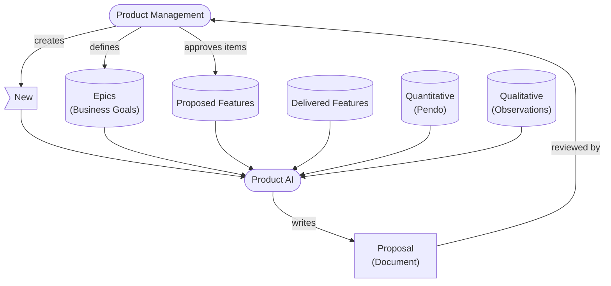
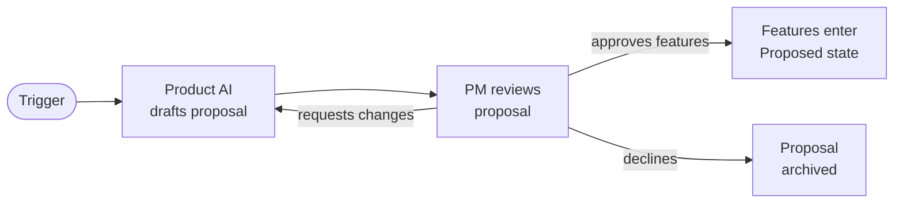
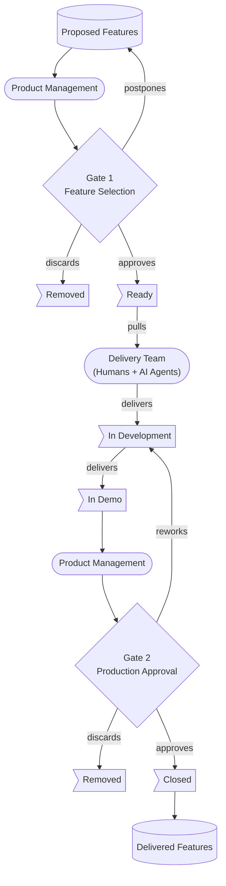
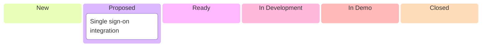
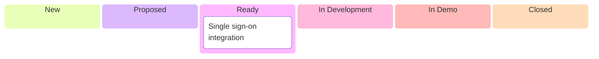
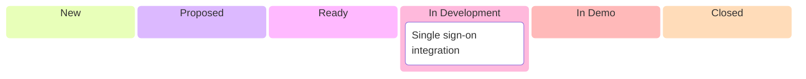
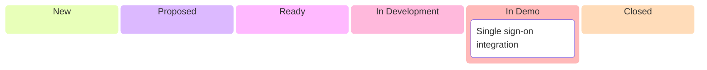
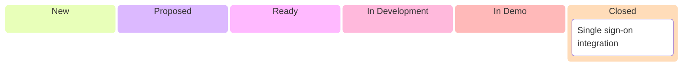
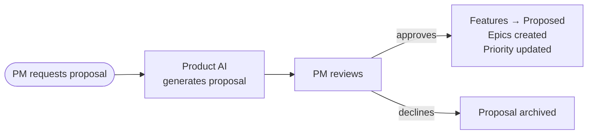
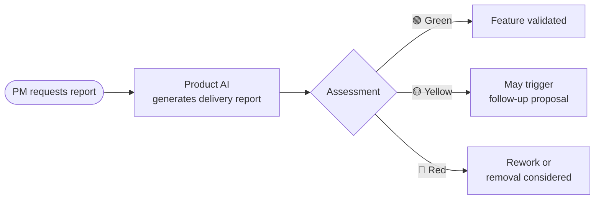

# AI-First Agile Process

## Overview

A Product AI agent continuously discovers and develops features by combining business goals with quantitative and qualitative data. Product management retains decision authority at two gates: which features to build (Gate 1) and which features to ship (Gate 2). A delivery team of humans and AI agents implements approved features.

A kanban board maps the value delivery stream. The paradigm is to move features to a decision gate as fast as possible and get them through as fast as possible. The Product AI accelerates this by reducing process time and supporting human decisions at each stage. It also uses flow metrics to predict timelines and identify risks.

### Roles and Responsibilities

| Role | Responsibility |
| --- | --- |
| **Product Management** | Sets business direction through epics. Proposes features. Approves or rejects at both gates. |
| **Product AI** | Discovers and develops features by synthesising epics, delivered features, and external data. |
| **Delivery Team** | Humans and AI agents who pull approved features, develop them, and deliver to demo. |

### Epics

Business goals that describe what the product should achieve, not how. An epic states what success looks like without prescribing the method of measurement. Epics are long-lived and may span multiple features.

### Features

A discrete chunk of functionality hypothesised to deliver value towards an epic's goals. Each feature includes:

- **Description** — what the feature is and what problem it solves.
- **Acceptance criteria** — defines the boundaries and scope of the feature.
- **Leading indicators** — quantitative or qualitative measurements that signal whether the feature is delivering its expected value.

## Feature Discovery

### Proposals

A **proposal** is the primary output of the Product AI's discovery work. It is a structured document that recommends new epics and features, grounded in evidence from quantitative data, qualitative observations, and alignment with existing business goals.

#### What triggers a proposal

- Product management requests one (ad hoc or scheduled).
- A significant change in data signals (e.g., a metric crosses a threshold, new qualitative feedback arrives).
- A periodic cadence (e.g., weekly or per sprint) to ensure the backlog stays fresh.

#### Proposal structure

Each proposal contains:

1. **Current state summary** — snapshot of delivered features, in-progress work, and active epics.
2. **Proposed epics** — new business goals with a statement of what success looks like. Only included when existing epics don't cover the opportunity.
3. **Proposed features** — each with:
   - Link to an epic (new or existing).
   - Description, acceptance criteria, and leading indicators.
   - **Data support** — specific quantitative metrics and qualitative observations that justify the feature.
4. **Roadmap impact** — how the new work fits alongside existing commitments.

#### Data support requirement

Every proposed feature must cite at least one quantitative data point and one qualitative observation. This prevents feature proposals based solely on intuition or technical interest. The Product AI synthesises these from available data sources:

| Source | Type | Examples |
| --- | --- | --- |
| Analytics (Pendo) | Quantitative | Bounce rates, click-through, session durations, conversion funnels |
| Observations | Qualitative | User interviews, support tickets, in-store feedback cards, staff notes |
| Delivered features | Context | What already exists, what gaps remain |

#### Proposal lifecycle

1. **Draft** — Product AI generates the proposal document, citing data sources.
2. **Review** — Product management reads the proposal. They may approve all, some, or none of the recommended features.
3. **Approve** — Approved features are created as work items in the Proposed state, ready for Gate 1.
4. **Revise** — PM may ask the Product AI to refine proposals (different scope, different epic, more evidence).
5. **Archive** — Declined proposals are retained for reference but no work items are created.

#### Proposal ≠ commitment

A proposal is a recommendation, not a decision. Product management retains full authority over which features enter the backlog. The proposal accelerates decision-making by doing the research, structuring the argument, and presenting options — but the human decides.

## Delivery Pipeline

## Kanban States

### New

A rough feature idea has been created by product management or the Product AI. It may lack acceptance criteria, leading indicators, or a clear link to an epic. Features in this state enter the discovery process.

### Proposed

The feature has been developed with a description, acceptance criteria, and leading indicators. It is ready for product management to review at Gate 1.

**Gate 1 — Feature Selection.** Product management reviews and decides:
- **Approve** — feature moves to Ready.
- **Postpone** — feature remains in Proposed for future re-evaluation.
- **Discard** — feature is removed.

A feature must have minimum requirements fulfilled (description, acceptance criteria, leading indicators) before it can pass Gate 1.

### Ready

The feature has been approved and waits in a prioritised queue. The delivery team pulls from the top of this queue when they have capacity.

### In Development

The delivery team (humans and AI agents) implements the feature. The team collaborates directly with users and stakeholders during development to validate assumptions and refine the solution.

### In Demo

The feature has been delivered to a demo environment. Product management interacts with the working software and validates it against the acceptance criteria.

**Gate 2 — Production Approval.** Product management reviews and decides:
- **Approve** — feature moves to Closed.
- **Rework** — feature returns to In Development with feedback for the delivery team to address.
- **Discard** — feature is removed.

### Closed

The feature is live in production. It is monitored against its leading indicators and becomes part of delivered features, informing future discovery.

## Example: Single Sign-On Integration

How a feature moves through the value stream from discovery to delivery.

**Context:** The epic "Reduce Login Friction" is defined. Pendo shows 23% login abandonment (quantitative). Users report password fatigue (qualitative, observations).

### New → Proposed

The Product AI identified this feature by combining the epic "Reduce Login Friction" with Pendo data (23% login abandonment) and user observations about password fatigue. It drafted the description, acceptance criteria, and leading indicators.

**Product AI support:** Synthesises data sources to draft the feature description, suggest acceptance criteria, and identify leading indicators.

---

### Proposed → Ready (Gate 1)

Product management reviewed the SSO feature and approved it at Gate 1. The feature now waits in the prioritised queue.

**Product AI support:** Suggests prioritisation order based on epic alignment, expected impact, and delivery team capacity. Flags duplicate features or overlapping requirements across the queue. Continuously revises features in this state to prevent them from going stale.

---

### Ready → In Development

The delivery team had capacity and pulled SSO from the top of the Ready queue. Implementation is underway.

**Product AI support:** Clarifies requirements and answers questions about the feature's intent. Tracks changes to feature scope during development, keeping the feature description aligned with the implementation to prevent drift. Helps the delivery team understand whether the implemented code covers the feature's requirements. If needed, supports splitting out requirements into separate features to help delivery of the highest value parts first.

---

### In Development → In Demo

The delivery team has delivered SSO to the demo environment. Product management can now interact with the working software.

**Product AI support:** Compiles a summary of what was delivered against the original acceptance criteria. Captures information from Pendo and transcripts from Teams sessions to provide product management with feedback on rework decisions or potential discarding.

---

### In Demo → Closed (Gate 2)

Product management reviewed SSO in demo, confirmed it meets acceptance criteria, and approved it at Gate 2. The feature is live in production.

**Product AI support:** Monitors leading indicators and flags when metrics diverge from expectations. Uses the delivered feature as input for discovering follow-up improvements.

## Product Reports

Three report types support product management decision-making at different stages of the lifecycle. They are stored alongside the codebase in `claude_reports/`.

### Feature Delivery Reports (`claude_reports/delivery/feature-{number}-{short-name}.md`)

A feature delivery report is created **once, at delivery time**, as part of the feature delivery lifecycle (step 3). It captures the feature's initial performance snapshot using data generated immediately after launch.

**When created:** Automatically during the delivery lifecycle — not requested separately.

**Purpose:** Documents what was delivered, confirms acceptance criteria were met, and records the feature's first 3 weeks of leading indicator performance.

This report is the baseline. It establishes the initial data point against which future delivery reports can compare.

---

### Proposals (`claude_reports/proposals/`)

A proposal is a data-driven recommendation for the product's next direction. It synthesises current analytics, user feedback, delivered features, and active epics to identify the highest-value opportunities.

**When generated:** On demand — product management requests a proposal when they need to set or adjust direction.

**Inputs:**
- Current epics and their state (delivered, in-progress, proposed)
- Quantitative data (Pendo analytics)
- Qualitative data (user feedback, observations)
- Existing backlog (proposed features not yet delivered)

**Structure:**
1. **Current state summary** — delivered features, active epics, key metric movements since last proposal.
2. **Strategic direction** — why this direction is the right one now, grounded in data trends and business goals.
3. **Proposed epics and features** — each with description, acceptance criteria, leading indicators, and explicit data support (at least one quantitative metric + one qualitative observation per feature).
4. **Roadmap impact** — how the proposed work fits alongside existing commitments.

**Backlog consequences of acceptance:**
- Approved features enter the **Proposed** state on the project board.
- New epics are created on the project board with their sub-issues linked.
- Prioritisation on the project board may be re-ordered to reflect the approved direction.
- Declined items from the proposal are not created — the proposal itself is retained for reference.

---

### Delivery Reports (`claude_reports/delivery/delivery-report-{number}-{short-name}.md`)

A delivery report is an on-demand validation that uses **current** product data to assess whether a delivered feature is still performing against its proposed value. Unlike the feature delivery report (created once at launch), a delivery report can be requested at any point after delivery to get a fresh assessment with up-to-date data.

**When generated:** On demand — product management requests a delivery report for any closed feature they want to validate.

**Inputs:**
- The feature's defined leading indicators (from the issue or prior proposal)
- Current quantitative data (Pendo events related to the feature)
- Current qualitative data (user feedback referencing the feature)

**Structure:**
1. **Feature details** — epic, status, delivery date, PR link, description.
2. **Leading indicators** — the indicators defined for this feature.
3. **Current performance** — latest metrics from analytics data, with tables, trends, and interpretation.
4. **User sentiment** — relevant feedback entries referencing this feature.
5. **Assessment** — indicators compared to targets with verdicts (✅/❌), overall rating (🟢 green / 🟡 yellow / 🔴 red), and recommended actions.

**Consequences:**
- A 🟢 green report confirms the feature is delivering value — no action required.
- A 🟡 yellow report signals the feature may need iteration — can trigger a follow-up proposal.
- A 🔴 red report indicates the feature is underperforming — informs future discovery and may lead to rework or removal.

---

## Values and Principles

- **Working software over documentation** — features are validated in a demo environment, not through specifications alone.
- **Customer collaboration** — the team collaborates with users through observations, demos, and interviews — not just through data.
- **Responding to change** — continuous discovery, rework paths, and postpone options allow the process to adapt at every stage. Feature inspection is always available, both current development state and potentially releasable software.
- **Sustainable pace** — the delivery team pulls work when they have capacity. WIP is limited to maintain quality and predictability.
- **Human decisions, AI leverage** — AI develops and builds; humans decide what ships.
- **Two gates** — no feature reaches production without two explicit product management approvals.
- **Data-informed discovery** — feature proposals are grounded in both qualitative and quantitative evidence.
- **Fast feedback loops** — demo environment enables rapid review before production commitment.

## Examples

**Epic: Reduce Login Friction**

**Goal:** Users can access the system quickly and without frustration, reducing barriers to daily use.

**What success looks like:** Fewer users abandon the login process, and fewer support tickets are raised about access issues.

**Epic: Improve Data Visibility**

**Goal:** Users can find and understand the data they need without relying on other people or manual workarounds.

**What success looks like:** Users spend less time searching for information and make fewer requests for ad-hoc reports.

**Feature: Single Sign-On Integration**

| | |
|---|---|
| **Epic** | Reduce Login Friction |
| **Description** | Allow users to authenticate using their corporate identity provider instead of a separate username and password. |
| **Acceptance criteria** | <ul><li>Users can log in via SSO from the login page</li><li>Users without SSO fall back to email/password</li><li>No existing sessions are disrupted during rollout</li></ul> |
| **Leading indicators** | Login abandonment rate (quantitative, Pendo). Password reset request volume (quantitative, Pendo). User feedback on login experience (qualitative, observations). |

**Feature: Saved Search Filters**

| | |
|---|---|
| **Epic** | Improve Data Visibility |
| **Description** | Allow users to save frequently used search filter combinations and reapply them with one click. |
| **Acceptance criteria** | <ul><li>Users can save, name, and delete filter presets</li><li>Presets are personal and persist across sessions</li><li>Maximum 20 presets per user</li><li>Presets are accessible from the search page header</li></ul> |
| **Leading indicators** | Search usage frequency (quantitative, Pendo). Time spent configuring filters (quantitative, Pendo). User requests for "quick access" to data (qualitative, observations). |

**Feature: Dashboard Summary Email**

| | |
|---|---|
| **Epic** | Improve Data Visibility |
| **Description** | Send a daily or weekly email summarising key dashboard metrics so users stay informed without logging in. |
| **Acceptance criteria** | <ul><li>Users can opt in/out and choose frequency (daily or weekly)</li><li>Email includes top-level metrics only, no sensitive data in plain text</li><li>Unsubscribe link in every email</li><li>Email is sent by 8am in the user's local timezone</li></ul> |
| **Leading indicators** | Email open rate (quantitative, Pendo). Dashboard visit frequency after rollout (quantitative, Pendo). User feedback on usefulness of summary (qualitative, observations). |

